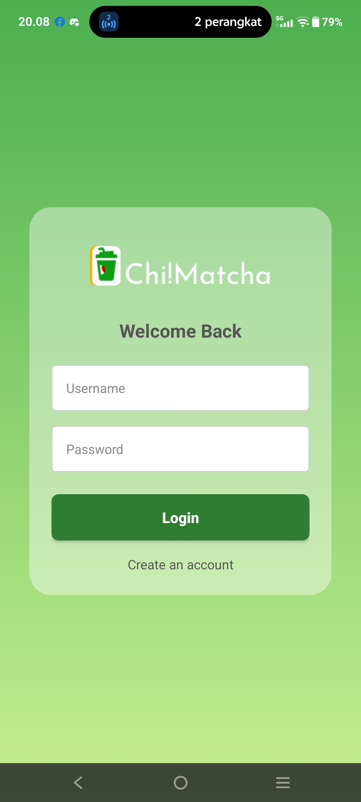
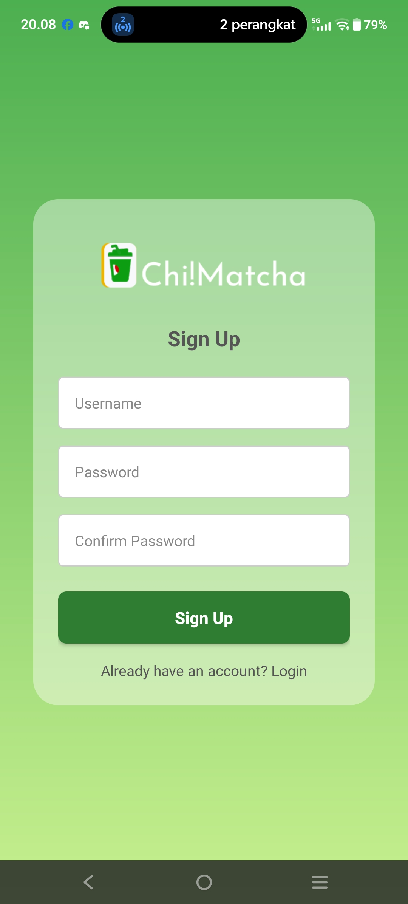
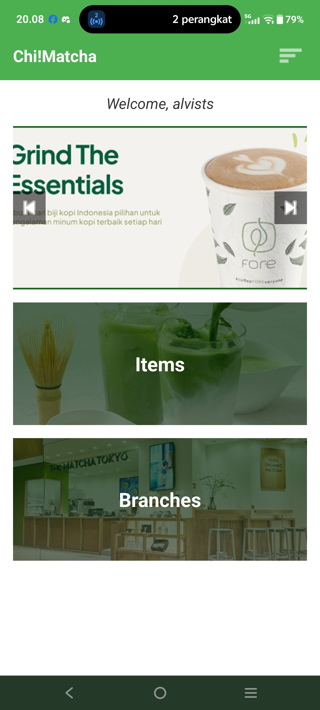
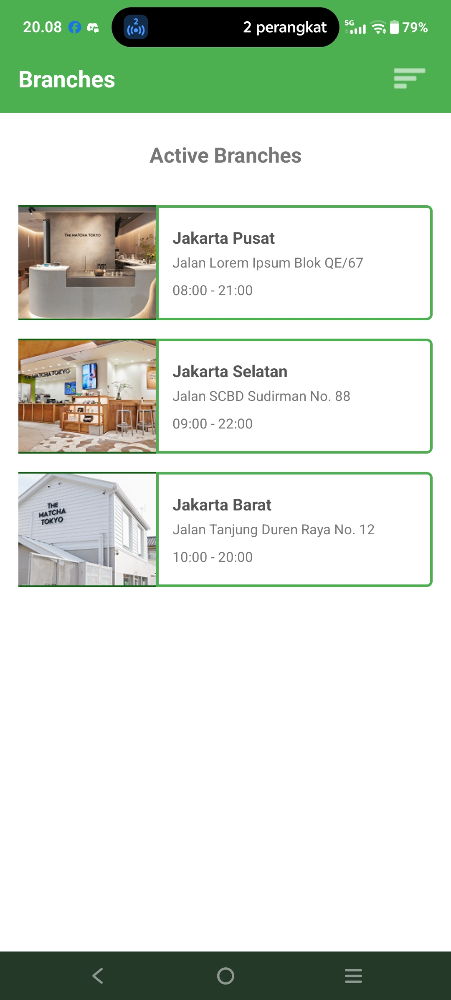
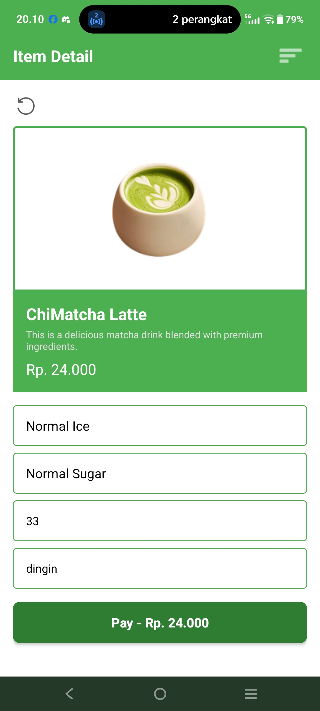
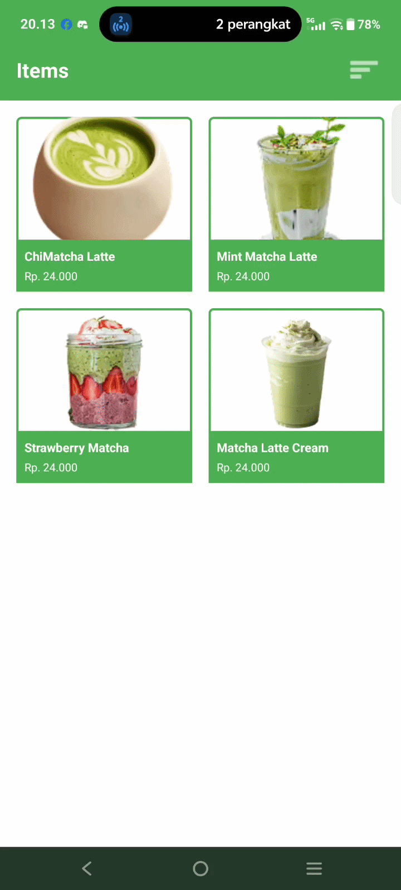

# UX_Matchaaa

[](https://developer.android.com)
[](https://www.java.com)
[](https://developer.android.com/studio)
[-02303A?logo=gradle&logoColor=white)](https://gradle.org)
[](https://developer.android.com)

A native Android application for browsing and ordering matcha products, built in Java to translate a complex Figma design into clean, modular, and reusable UI components.

---

## Short Description

**UX_Matchaaa** is a native Android mobile app that delivers a polished matcha catalog and ordering experience. The project focuses on faithfully translating a detailed Figma design into production-ready UI while applying Object-Oriented Programming (OOP) principles for maintainable, well-structured code.

---

## Key Features

- **Modular UI Components** — Reusable layout components (such as `item_branch_card.xml` and `item_matcha_card.xml`) that keep screens consistent and easy to extend.
- **Pixel-Faithful Figma Translation** — Complex Figma mockups converted into accurate Android layouts, including custom fonts, gradients, and themed card styling.
- **Optimized Catalog Workflow** — A streamlined browsing-to-detail flow that improved the catalog navigation process by roughly **25%**, reducing friction between discovery and selection.
- **Multi-Screen User Journey** — Full flow across onboarding, registration, home, branch selection, product catalog, and product detail screens.
- **Order Confirmation Experience** — A dedicated payment success dialog that gives users clear, satisfying feedback at checkout.
- **Clean, OOP-Driven Codebase** — Activities and components organized around clear responsibilities for readability and scalability.

---

## Tech Stack & Architecture

| Category | Details |
| --- | --- |
| **Language** | Java |
| **IDE** | Android Studio |
| **Design** | Figma (source of the UI/UX design) |
| **Build System** | Gradle with Kotlin DSL (`build.gradle.kts`) |
| **UI Toolkit** | AndroidX — AppCompat, Material Components, Activity, ConstraintLayout |
| **Testing** | JUnit (unit tests), AndroidX Instrumented tests |
| **Java Compatibility** | Java 11 (source & target) |
| **SDK** | compileSdk 35 · minSdk 35 · targetSdk 35 |

### Architecture & Approach

The project is built around **Object-Oriented Programming (OOP)** and **Clean Code** principles:

- **Separation of concerns** — Each screen is driven by its own `Activity`, keeping logic focused and self-contained.
- **Reusable components** — Shared card layouts are defined once and reused across lists, avoiding duplication.
- **Resource-driven styling** — Colors, gradients, fonts, and backgrounds live in dedicated resource files, making the UI easy to theme and maintain.
- **Design-to-code fidelity** — The Figma design acts as the single source of truth, with layouts structured to mirror the intended visual hierarchy.

---

## UI/UX Showcase

A screen-by-screen look at the app.

<table>
  <tr>
    <th align="center">Landing / Main</th>
    <th align="center">Register</th>
    <th align="center">Home</th>
  </tr>
  <tr>
    <td align="center"></td>
    <td align="center"></td>
    <td align="center"></td>
  </tr>
  <tr>
    <th align="center">Branch Selection</th>
    <th align="center">Catalog (Items)</th>
    <th align="center">Item Detail</th>
  </tr>
  <tr>
    <td align="center"></td>
    <td align="center"></td>
    <td align="center"></td>
  </tr>
</table>

### Live Demo

<table>
  <tr>
    <th align="center">End-to-End App Walkthrough</th>
  </tr>
  <tr>
    <td align="center"></td>
  </tr>
</table>

---

## Installation / Getting Started

### Prerequisites

- [Android Studio](https://developer.android.com/studio) (latest stable version recommended)
- Android SDK Platform **35**
- JDK **11** or higher

### Steps

1. **Clone the repository**

   ```bash
   git clone https://github.com/AlvistCruise/UX_Matchaaa.git
   ```

2. **Open the project in Android Studio**

   - Launch Android Studio.
   - Select **File → Open** and choose the cloned `UX_Matchaaa` folder.

3. **Let Gradle sync**

   - Android Studio will automatically sync the project with the Gradle files. Wait for the sync to finish.

4. **Run the app**

   - Select an emulator or connect a physical device running **Android API 35+**.
   - Click **Run ▶** (or press `Shift + F10`) to build and launch the app.

   You can also build from the command line:

   ```bash
   ./gradlew assembleDebug
   ```

---

## Project Structure

```text
UX_Matchaaa/
├── app/
│   ├── build.gradle.kts            # App module build config (Kotlin DSL)
│   ├── proguard-rules.pro
│   └── src/
│       ├── main/
│       │   ├── AndroidManifest.xml
│       │   ├── java/com/example/ux_matchaaa/
│       │   │   ├── MainActivity.java        # Entry / onboarding screen
│       │   │   ├── RegisterActivity.java    # User registration
│       │   │   ├── HomeActivity.java        # Home / dashboard
│       │   │   ├── BranchActivity.java      # Branch selection
│       │   │   ├── ItemActivity.java        # Product catalog
│       │   │   └── ItemDetailActivity.java  # Product detail
│       │   └── res/
│       │       ├── drawable/                # Cards, gradients, inputs, images
│       │       ├── font/                    # Poppins & custom font family
│       │       ├── layout/                  # Screen & reusable card layouts
│       │       │   ├── activity_main.xml
│       │       │   ├── activity_register.xml
│       │       │   ├── activity_home.xml
│       │       │   ├── activity_branch.xml
│       │       │   ├── activity_item.xml
│       │       │   ├── activity_item_detail.xml
│       │       │   ├── dialog_payment_success.xml
│       │       │   ├── item_branch_card.xml  # Reusable branch card
│       │       │   └── item_matcha_card.xml  # Reusable product card
│       │       ├── menu/
│       │       ├── mipmap-*/                 # Launcher icons & densities
│       │       └── values/                   # Colors, strings, themes
│       ├── test/                             # JUnit unit tests
│       └── androidTest/                      # Instrumented tests
├── build.gradle.kts                # Root build config
├── settings.gradle.kts
├── gradle/                         # Gradle wrapper
└── README.md
```

---

## License

This project is maintained by [AlvistCruise](https://github.com/AlvistCruise). Please refer to the repository for licensing details.
